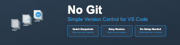

# No Git - Simple Version Control for VS Code

## Why No Git?

Ever felt that Git is overkill for your small project? Need a simple way to create snapshots of your work without the complexity of a full version control system? **No Git** is your solution!

### 🎯 Perfect For:
- **Solo Projects**: When you just need to track your own changes
- **Learning/Teaching**: Perfect for students learning to code without the overhead of Git
- **Quick Prototypes**: When you want to experiment safely without setting up a repository
- **Non-Technical Users**: When you need version control but Git feels too complex
- **Temporary Backups**: Quick snapshots before making major changes

### 🌟 Key Features

- **Simple Snapshots**: Create up to 10 named snapshots of your entire workspace
- **One-Click Restore**: Easily return to any previous snapshot
- **No Configuration**: Works right out of the box
- **Visual Interface**: No command line needed
- **Lightweight**: Minimal impact on your workspace
- **No External Dependencies**: Everything stays in your project folder

## 📸 How It Works

No Git creates a `.backup` folder in your workspace where it stores snapshots of your files. Each snapshot is a complete copy of your workspace at a specific point in time, making it easy to restore your entire project to a previous state.

### Available Commands:

- `No Git: Create Snapshot` - Save your current workspace state
- `No Git: Restore Snapshot` - Return to a previous snapshot
- `No Git: List Snapshots` - View all your saved snapshots

## 🚀 Getting Started

1. Install the extension from VS Code Marketplace
2. Open your project folder in VS Code
3. Use Command Palette (Ctrl+Shift+P or Cmd+Shift+P) and type "No Git"
4. Create your first snapshot!

## 💡 Usage Examples

### Creating a Snapshot
1. Make changes to your files
2. Open Command Palette
3. Run "No Git: Create Snapshot"
4. Enter a name (e.g., "before-refactoring")
5. Done! Your code is safely stored

### Restoring a Snapshot
1. Open Command Palette
2. Run "No Git: Restore Snapshot"
3. Select the snapshot you want to restore
4. Confirm the restore
5. Your code is back to the previous state!

## ⚡️ Why Choose No Git Over Git?

| Feature | No Git | Git |
|---------|--------|-----|
| Learning Curve | Minutes | Days/Weeks |
| Commands to Learn | 3 | 20+ |
| Setup Time | None | Repository initialization required |
| Interface | Visual | Command-line first |
| Best For | Solo projects & quick snapshots | Team collaboration & complex versioning |

## 🛡️ Safe and Secure

- All snapshots are stored locally in your project
- No cloud storage or external services
- No data leaves your computer
- Clear visual confirmation before restoring snapshots

## 📝 Smart Features

- Automatically ignores system files and folders
- Prevents duplicate snapshot names
- Maintains snapshot history with timestamps
- Shows preview of changes before restore

## 🎓 Perfect for Education

Teachers love No Git because:
- Students focus on coding, not version control
- No need to teach Git commands
- Easy to demonstrate code evolution
- Perfect for assignments and projects

## 🚫 When Not to Use No Git

Be transparent about when to use Git instead:
- For team projects
- When you need branching and merging
- For open-source contributions
- When you need a detailed change history

## 📊 Technical Details

- Stores snapshots in `.backup` folder
- Uses simple JSON for metadata
- Ignores `.backup`, `node_modules`, and hidden folders
- Limits total snapshots to 10 for space efficiency

## 🤝 Contributing

Found a bug or have a suggestion? We'd love to hear from you!
- Open an issue on [GitHub](https://github.com/Shellomo/vscode_ext_nogit)
- Submit a pull request 
- Share your feedback via email

## 📜 License

MIT License - Feel free to use in your projects!

## 🙋‍♂️ Support

Need help? Have questions?
- Open an issue on GitHub 

---

Made with ❤️ for developers who want simplicity