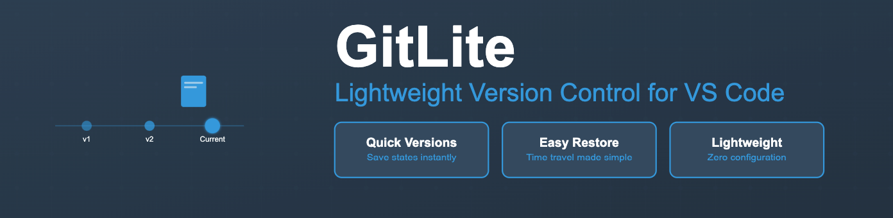

# GitLite - Lightweight Version Control for VS Code

## Why GitLite?

Need version control but want to keep things simple? **GitLite** offers a lightweight approach to tracking your code changes. It's version control that gets out of your way, letting you focus on what matters - your code.

### 🎯 Perfect For:
- **Solo Projects**: Track changes without the complexity of a full VCS
- **Learning/Teaching**: Ideal for students learning to code
- **Quick Prototypes**: Experiment safely with instant version saves
- **Casual Developers**: When you need version control that just works
- **Quick Backups**: Create instant snapshots before major changes

### 🌟 Key Features

- **Quick Versions**: Save up to 10 named versions of your workspace
- **Time Travel**: Instantly restore to any saved version
- **Zero Config**: Works immediately after installation
- **Visual Interface**: Everything through VS Code's UI
- **Lightweight**: Minimal overhead, maximum efficiency
- **Self-Contained**: Everything stays in your project folder

## 📸 How It Works

GitLite creates a `.backup` folder in your workspace to store versions of your files. Each version is a complete snapshot of your workspace, making it easy to restore your entire project to any saved state.

### Available Commands:

- `GitLite: Save Version` - Save your current workspace state
- `GitLite: Restore Version` - Return to a previous version
- `GitLite: Version History` - View all your saved versions

## 🚀 Getting Started

1. Install GitLite from VS Code Marketplace
2. Open your project folder in VS Code
3. Use Command Palette (Ctrl+Shift+P or Cmd+Shift+P) and type "GitLite"
4. Save your first version!

## 💡 Usage Examples

### Saving a Version
1. Make changes to your files
2. Open Command Palette
3. Run "GitLite: Save Version"
4. Enter a name (e.g., "before-refactoring")
5. Done! Your code is safely stored

### Restoring a Version
1. Open Command Palette
2. Run "GitLite: Restore Version"
3. Select the version you want to restore
4. Confirm the restore
5. Your code is back to the selected state!

## ⚡️ GitLite vs Traditional Git

| Feature | GitLite | Traditional Git |
|---------|---------|-----------------|
| Learning Curve | Minutes | Days/Weeks |
| Commands to Learn | 3 | 20+ |
| Setup Time | None | Repository setup required |
| Interface | Visual | Command-line focused |
| Best For | Solo projects & quick versions | Team collaboration & complex workflows |

## 🛡️ Safe and Secure

- All versions stored locally in your project
- No cloud storage or external services
- No data leaves your computer
- Clear confirmation before version restore

## 📝 Smart Features

- Automatically skips system files and folders
- Prevents duplicate version names
- Maintains version history with timestamps
- Shows preview before restore

## 🎓 Perfect for Education

Educators choose GitLite because:
- Students focus on coding, not version control
- No version control complexity
- Easy to demonstrate code evolution
- Ideal for assignments and projects

## 🤔 When to Use Traditional Git

GitLite is great for many scenarios, but consider traditional Git when you need:
- Team collaboration features
- Branch management
- Remote repository hosting
- Detailed commit history

## 📊 Technical Details

- Versions stored in `.backup` folder
- Simple JSON metadata
- Ignores `.backup`, `node_modules`, and hidden folders
- 10-version limit for efficiency

## 🤝 Contributing

We'd love to hear from you!
- Open an issue on [GitHub](https://github.com/Shellomo/vscode_ext_gitlite)
- Submit a pull request
- Share your feedback

## 📜 License

MIT License - Use freely in your projects!

## 🙋‍♂️ Support

Need help?
- Open an issue on GitHub
- Check our [documentation](https://github.com/Shellomo/vscode_ext_gitlite/)

---

Made with ❤️ by developers, for developers